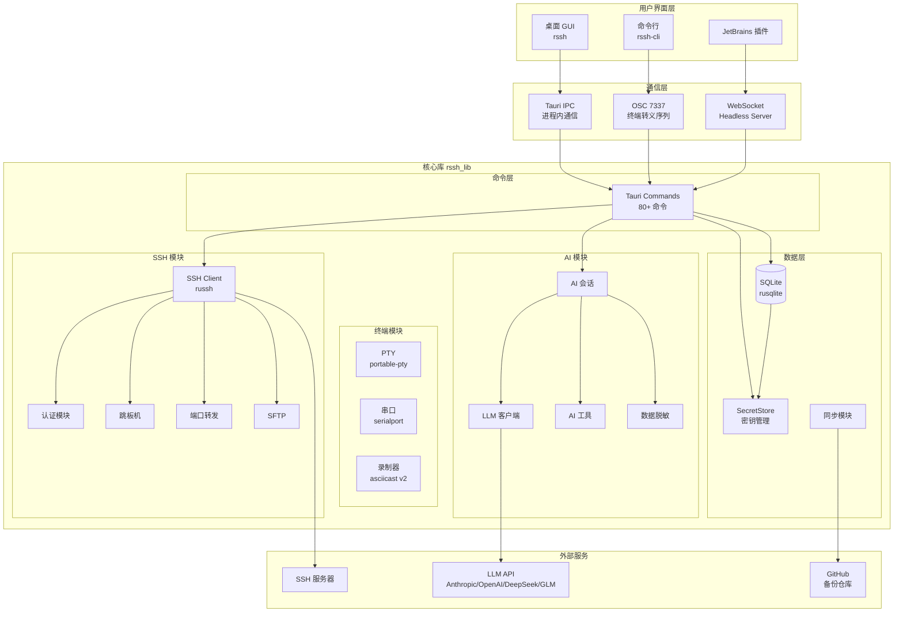
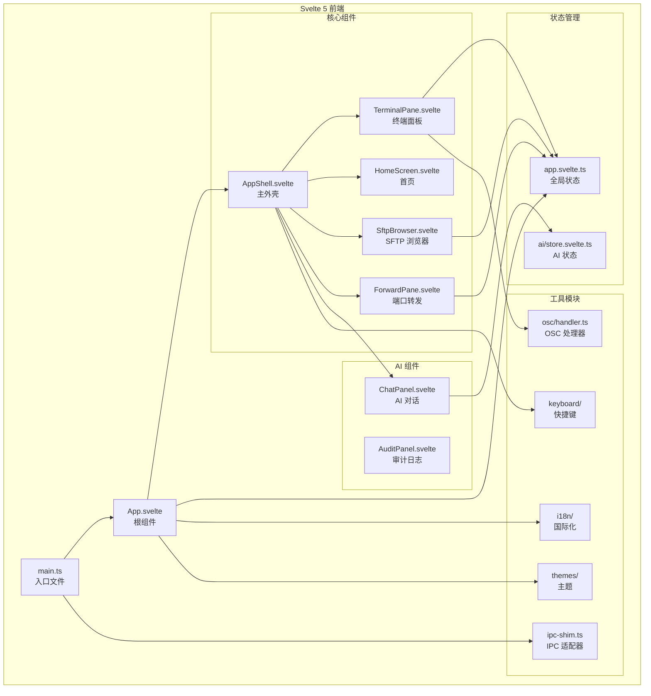
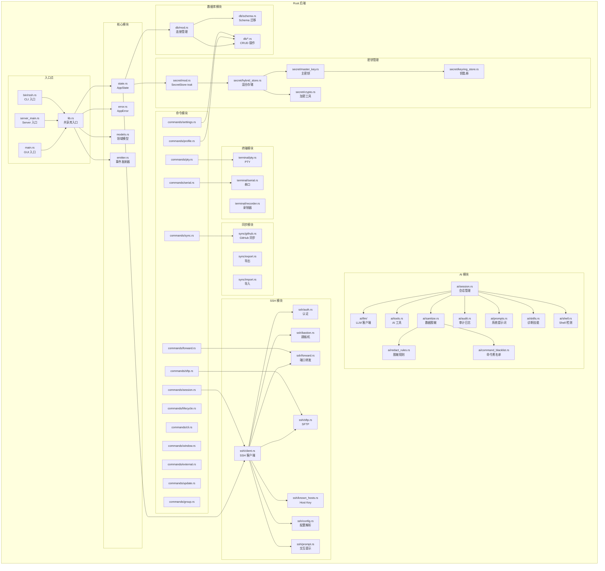
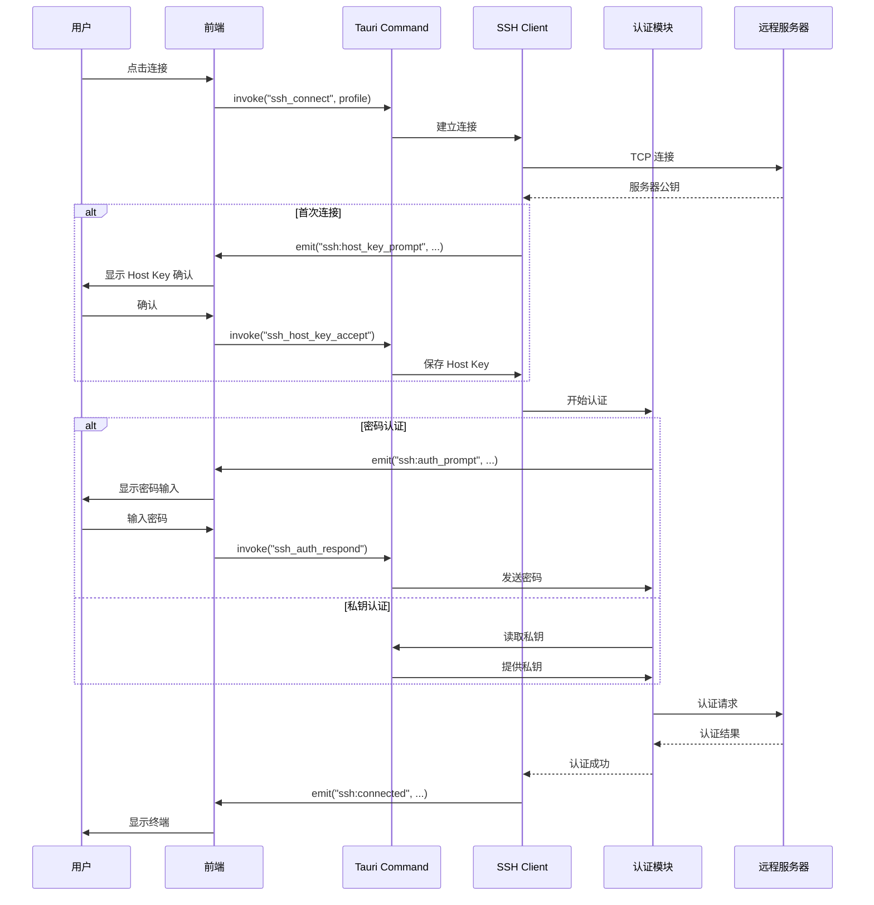
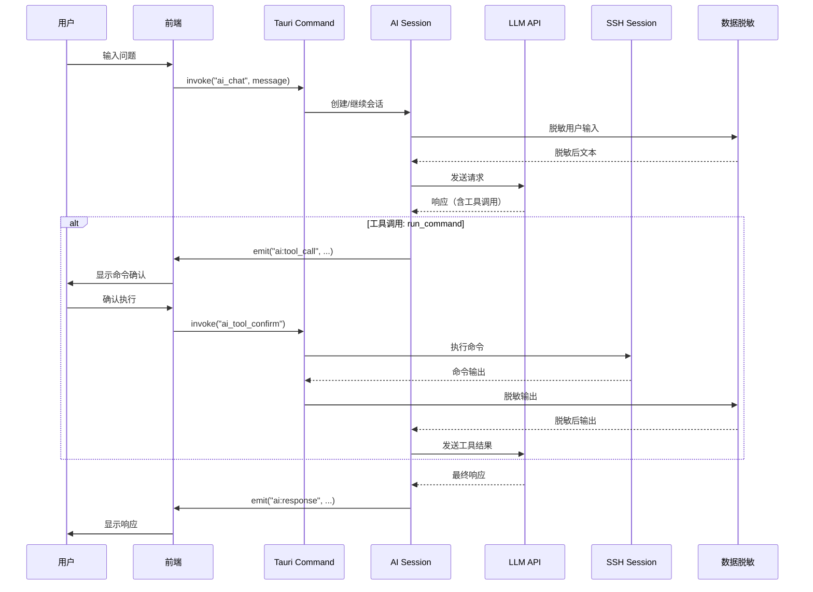
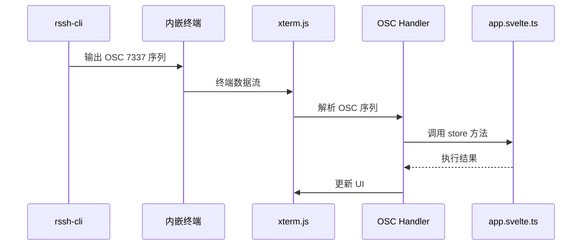
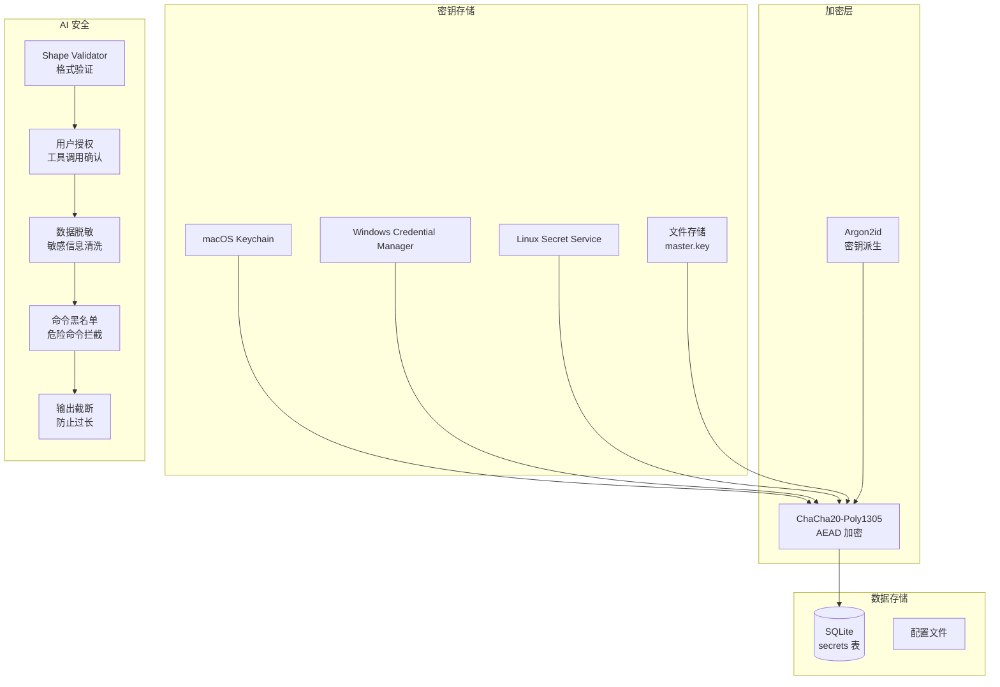
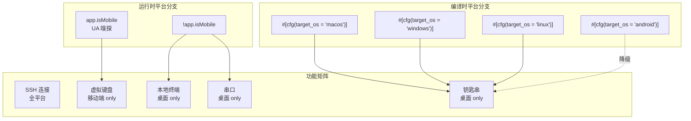
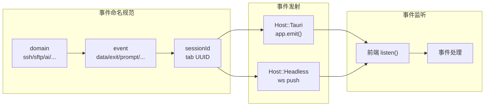
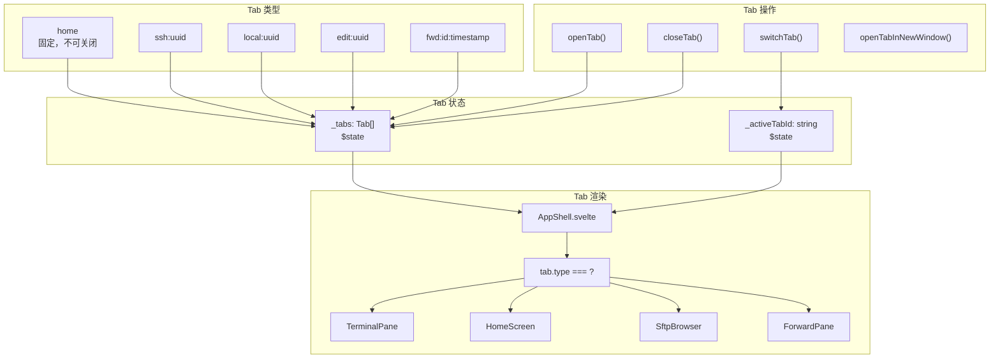

# RSSH 架构设计文档

> 可视化架构图与数据流说明

---

## 1. 系统整体架构

---

## 2. 前端架构

---

## 3. 后端架构

---

## 4. 数据流

### 4.1 SSH 连接流程

### 4.2 AI 诊断流程

### 4.3 CLI ↔ GUI 通信流程

---

## 5. 安全架构

---

## 6. 平台适配架构

---

## 7. 事件系统架构

---

## 8. Tab 管理架构

---

*文档版本：v1.0*
*最后更新：2026-06-11*
